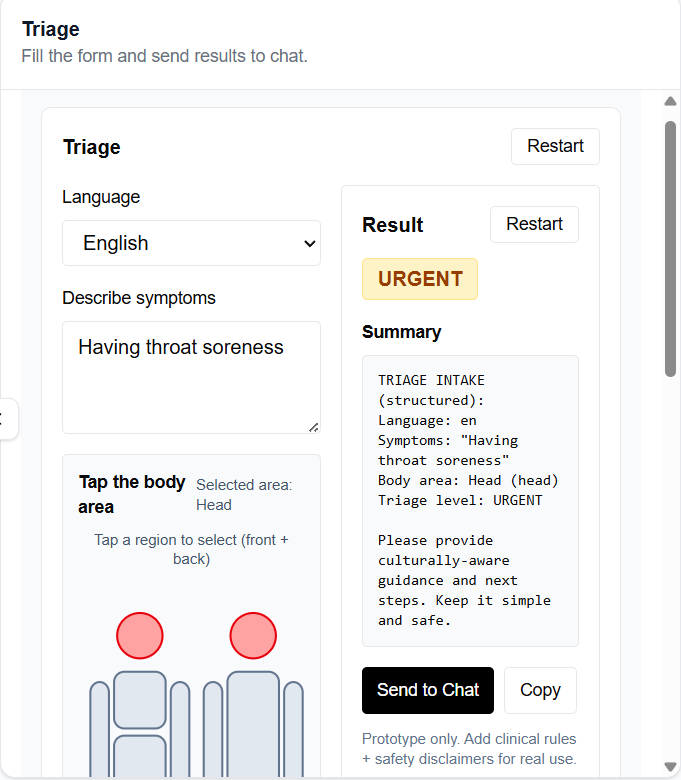
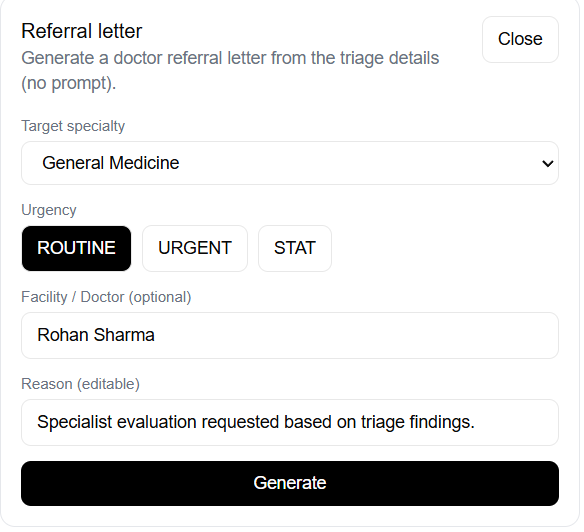
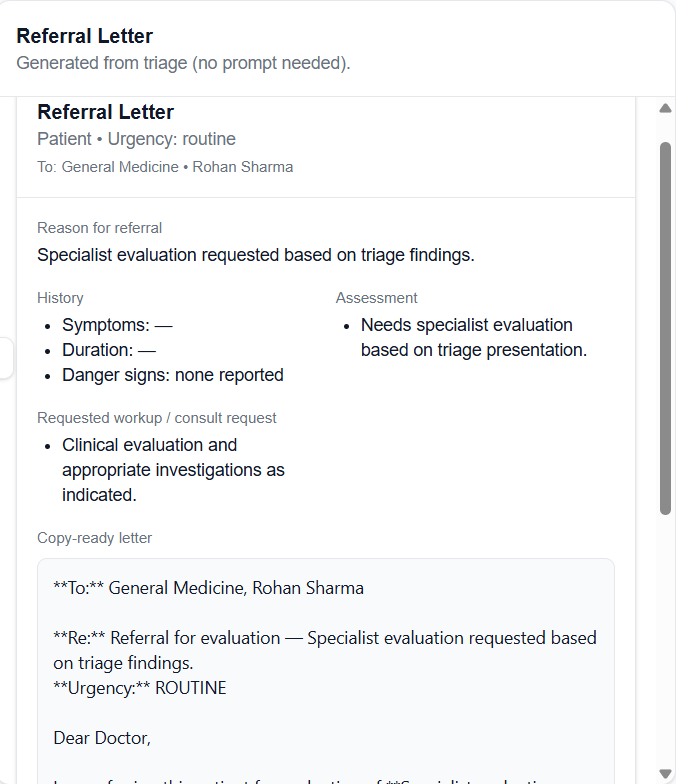
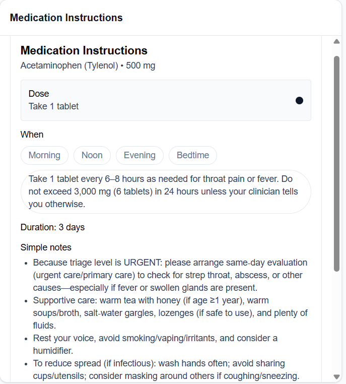
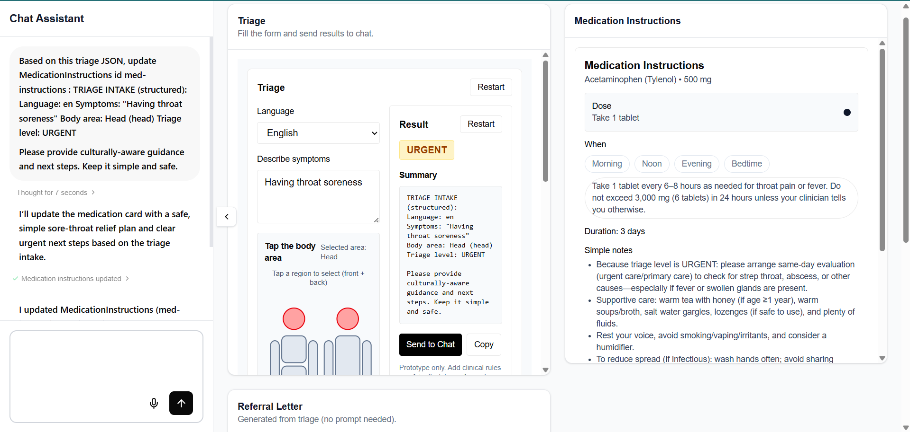
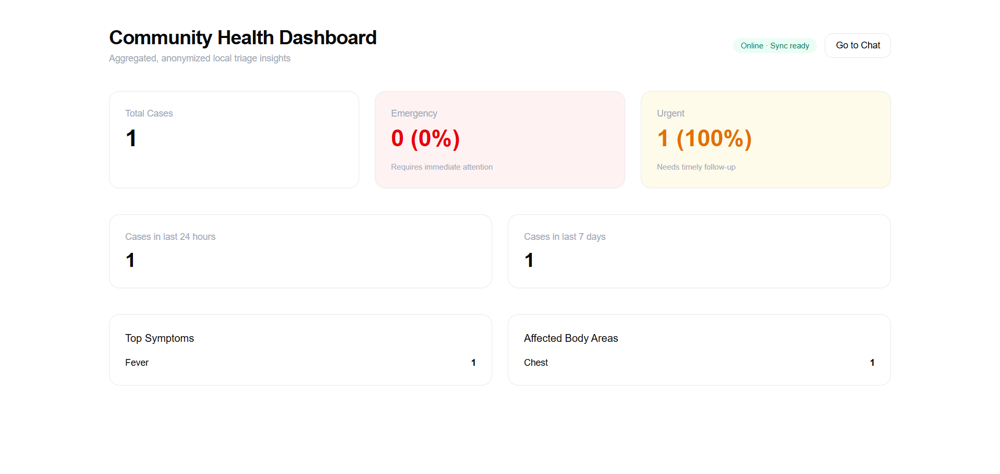

# 🏥 Healthcare Triage Assistant for Underserved Communities

An **Tambo AI-powered, offline-capable healthcare triage system** designed for underserved and rural communities.

---

## 🌍 Problem
Over **2B+ people** lack access to quality healthcare.
Rural and remote areas urgently need intelligent, accessible triage tools to reduce delayed care and preventable deaths.

---

## 💡 Solution
An offline-first Progressive Web App (PWA) that delivers:

**Intelligent symptom triage**

**Visual, low-literacy medication guidance**

**Automated doctor referral letters**

**Community-level health insights**

---

## ✨ Features

### 1. Multi-language Symptom Input + Body Diagrams
- Local-language symptom entry  
- Interactive visual body selection 
- Reduces literacy and language barriers 

### 2. Intelligent Triage Engine
- Classifies cases into:
  - **Emergency** 
  - **Urgent** 
  - **Routine**  
- Rule-based decision trees for safe escalation

### 3. Medication Instructions (Auto-generated)
- Generated from triage outcome  
- Simple dosage & timing instructions  
- Visual-first, low-literacy friendly  

### 4. Referral Letter Generation
- Auto-generated from triage data 
- Includes:
  - **Symptoms** 
  - **Assessment** 
  - **Urgency Level**
- Doctor-ready clinical format (copy & share)  

### 5. Community Health Dashboard
- Aggregated & anonymized insights  
- Tracks symptoms, urgency levels, trends  

### 6. Offline-First PWA
- Works without internet  
- Local data storage  
- Auto-sync when online  

---

## 📸 Screenshots

### Triage Flow

### Referral Form


### Referral Letters

### Medications Instructions


### Chat & Workflow


### Community Dashboard


## 🚀 Getting Started (Local Setup)

### 1️⃣ Clone the Repository
```bash
git clone https://github.com/your-username/sehat-sathi.git
cd sehat-sathi
```

---

### 2️⃣ Install Dependencies
```bash
npm install
```

---

### 3️⃣ Configure Tambo API Key

This project uses **Tambo AI** for triage reasoning and clinical text generation.

Create a `.env` file in the project root:

```env
NEXT_PUBLIC_TAMBO_API_KEY=your_tambo_api_key_here
```

#### ⚠️ Important
- **Do NOT** commit `.env` files to GitHub  
- Ensure the API key is available in your deployment environment  

---

### 4️⃣ Start Development Server
```bash
npm run dev
```

The app will be available at:
```
http://localhost:3000
```

*(or the port shown in your terminal)*

---

### 5️⃣ Build for Production
```bash
npm run build
```

---

### 6️⃣ PWA & Offline Mode
- App automatically caches assets after first load  
- Works offline using Service Workers  
- Data is stored locally and synced when online  


---

## 🌍 Impact
- Reduces delayed care deaths  
- Supports community health workers  
- Lowers system burden  

---

## 💰 Monetization
- NGOs & Government programs  
- Micro-subscriptions for clinics  

---

## ⚠️ Disclaimer
Decision-support only. Not a replacement for professional medical advice.